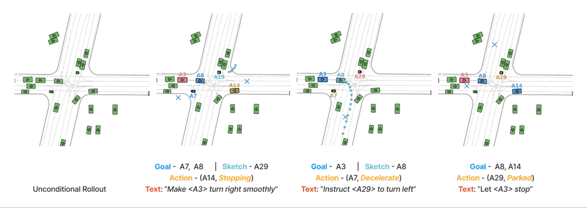

# Promptable Closed-loop Traffic Simulation

[**Promptable Closed-loop Traffic Simulation**](https://www.arxiv.org/abs/2409.05863)                                     
[Shuhan Tan](https://ariostgx.github.io/website/)<sup>1</sup>, [Boris Ivanovic](https://www.borisivanovic.com/)<sup>2</sup>,  [Yuxiao Chen](https://research.nvidia.com/person/yuxiao-chen/)<sup>2</sup>, [Boyi Li](https://sites.google.com/site/boyilics/home/)<sup>2</sup>, [Xinshuo Weng](https://www.xinshuoweng.com/)<sup>2</sup>,  [Yulong Cao](https://kikacaty.github.io/)<sup>2</sup>, [Philipp Krähenbühl](https://www.philkr.net/)<sup>1</sup>, [Marco Pavone](https://research.nvidia.com/person/marco-pavone/)<sup>2</sup>

<sup>1</sup>UT Austin, <sup>2</sup> NVIDIA

Conference on Robot Learning (CoRL), 2024

[**Webpage**](https://ariostgx.github.io/ProSim) | 
[**Video**](https://www.youtube.com/watch?v=6qHRhzIjRjI&t=1s) |
[**Paper**](https://www.arxiv.org/abs/2409.05863) |
[**Model Colab**](https://colab.research.google.com/drive/1T2N9SweJQ-35DYJKI9WPKxOeB2elujCk?usp=sharing) |
[**Data Colab**](https://colab.research.google.com/drive/1mcQCxpcZFnHLqjDQLYEJnuewvz-H5J4O?usp=sharing) | 
[**ProSim-Instruct-520k Dataset**](https://drive.google.com/file/d/1CMfp7PjWnyslHYC1kwvYA87T2KLtjHDN/view?usp=sharing) |
[**Mini Dataset**](https://drive.google.com/file/d/1Nh_ZzZ-Nk_T-Ufufcoav3UWgxskY1RzO/view?usp=sharing)



## News
* **`21 Oct, 2024`:**  Initial code and dataset release. Try out the online demo! 

We have also released raw data of ProSim-Instruct-520k. Stay tuned for the training pipeline!

## ProSim Model Colab Demo
We provide an online demo in [**Colab**](https://colab.research.google.com/drive/1T2N9SweJQ-35DYJKI9WPKxOeB2elujCk?usp=sharing). You can try it without any local installation. This demo includes:

1. Loading and visualize ground-truth data.
2. Use ProSim to conduct unconditional closed-loop simulation for all agents.
3. Use ProSim to conduct promptable closed-loop simulation for all agents.

Please also refer to the code inside for demonstrations of basic model usage.

*Note that this demo does not include text prompting, which requires Llama3-8B model which cannot be runned in standard colab environment.*

*Check the next section to see how to setup your own environment for text prompting.*

## Setup local environment

```bash
# Clone the code to local
git clone https://github.com/Ariostgx/ProSim.git
cd ProSim

# Create virtual environment
conda create -n prosim python=3.8
conda activate prosim

# Install dependencies
bash install_local_env.sh
```

## Quick start for Text Prompting
We provide a demo dataset and a pretrained model for quick start for text prompting.

### Download pretrained ProSim model

Please download the example model checkpoint `prosim_demo_model.ckpt` from [here](https://drive.google.com/file/d/1d_SyBGC8Ru-8Iw8c_JKvJ7PXZ96kGm7F/view?usp=sharing). Then put it into `prosim_demo/ckpt` folder.

### Setup Llama3-8B-Instruct model

Please download the Llama3-8B-Instruct model from [Meta's model hub](https://huggingface.co/meta-llama/Meta-Llama-3-8B-Instruct).

### Play with the demo notebook

We provide a demo notebook `prosim_demo/text_prompt_inference.ipynb` for text prompting. Just replace the `LLAMA_PATH` with your local path to Llama3-8B-Instruct model.


## ProSim-Instruct-520k

### Data loading pipeline colab demo
We provide a colab demo for loading the ProSim-Instruct-520k dataset [here](https://colab.research.google.com/drive/1mcQCxpcZFnHLqjDQLYEJnuewvz-H5J4O?usp=sharing). In this demo, we only load a subset of the dataset from [here](https://drive.google.com/file/d/1Nh_ZzZ-Nk_T-Ufufcoav3UWgxskY1RzO/view?usp=sharing) as a quick start. Check out this demo without any local installation or data preparation!

In the demo, we go through how to load the ProSim-Instruct-520k dataset paired with Waymo Open Dataset. Feel free to checkout the code in the demo notebook for details of data loading!

### Download full ProSim-Instruct-520k dataset.
We release the raw data of ProSim-Instruct-520k [here](https://drive.google.com/file/d/1CMfp7PjWnyslHYC1kwvYA87T2KLtjHDN/view?usp=sharing). It contains all the text prompts and motion tags for all scenarios in the Waymo Open Dataset training and validation sets. Feel free to download and preview the data.

Once the dataset is downloaded, unzip it and replace the `PROSIM_INSTRUCT_520K_DATA_DIR` parameter in `prosim/config/path_cfg.py` with the path to the unzipped folder.

### Download Waymo Open Dataset and prepare with Trajdata

We use [**Trajdata**](https://github.com/NVlabs/trajdata) to process the Waymo Open Dataset. Please follow the instructions in the [**Trajdata** repo](https://github.com/NVlabs/trajdata/blob/main/DATASETS.md) to download the Waymo Open Dataset and process it with Trajdata.

Once the dataset is processed by Trajdata, set `TRAJDATA_CACHE_DIR` in `prosim/config/path_cfg.py` to the path of the Trajdata cache folder. Also set `WAYMO_DATA_DIR` to the path of the downloaded Waymo Open Dataset.

### Play with the demo notebook

We provide a demo notebook `prosim_demo/load_prosim_instruct_520k.ipynb` for loading the ProSim-Instruct-520k dataset. Feel free to checkout the code in the demo notebook for details of data loading!
## Related repositories

We use code in [**LCTGen**](https://github.com/Ariostgx/lctgen) and [**Trajdata**](https://github.com/NVlabs/trajdata) for data processing and visualization.

## To Do
- [ ] Release dataset labeling tools.
- [ ] Release training pipeline.
- [x] Release dataset and data loading code.
- [x] Initial repo & demo

## Citation

```latex
@inproceedings{
    tan2024promptable,
    title={Promptable Closed-loop Traffic Simulation},
    author={Tan, Shuhan and Ivanovic, Boris and Chen, Yuxiao and Li, Boyi and Weng, Xinshuo and Cao, Yulong and Kr{\"a}henb{\"u}hl, Philipp and Pavone, Marco},
    booktitle={8th Annual Conference on Robot Learning},
    year={2024},
}
```